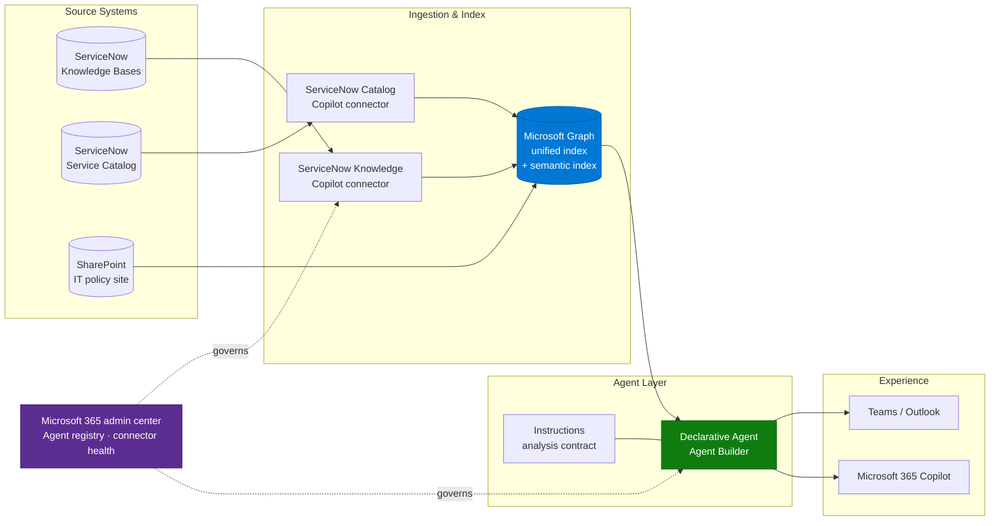

# Architecture — IT Service Desk Insights Agent

> **Platform**: Agent Builder / Microsoft 365 Copilot chat harness
> **Last Updated**: September 2026

---

## Read-Only Architecture

The Agent Builder implementation uses the Copilot chat harness, not the Copilot Studio
standard harness. This diagram covers knowledge/catalog retrieval only; it contains
no incident, feedback, or diagnostic feed.

Investigation and action tools belong to the separate
[GHCP scenario](../IT-Service-Desk-Insights-Agent-ghcp/2.Architecture.md), not this agent.

---

## Technology Stack

| Layer | Component | Purpose |
|---|---|---|
| Source | ServiceNow (Xanadu / Yokohama / Zurich) | Knowledge articles, catalog items, user criteria |
| Ingestion | ServiceNow Knowledge Copilot connector | Crawls `kb_knowledge`, carries user criteria as ACLs |
| Ingestion | ServiceNow Catalog Copilot connector | Crawls catalog items and their descriptions |
| Index | Microsoft Graph unified index + semantic index | Full-text and semantic retrieval, permission filtering |
| Agent | Declarative agent (Agent Builder) | Instructions, knowledge scoping, starter prompts |
| Identity | Microsoft Entra ID | Identity mapping between Entra and ServiceNow users |
| Governance | Microsoft 365 admin center → Copilot → Agents / Connectors | Agent registry, availability, connector health |

---

## Data Flow

1. Connector crawls ServiceNow on a schedule — full crawl daily, incremental every 15 minutes
   by default. Identity and user-criteria mappings only refresh on a **full** crawl.
2. Each article is written to the Graph index with content, metadata, and an ACL derived from
   its `Can Read` / `Cannot Read` user criteria.
3. A user asks the agent a question in Microsoft 365 Copilot.
4. Retrieval runs against the index **as that user** — items whose ACL excludes them are never
   returned to the model.
5. The model applies the agent instructions (analysis contract, language rule, citation rule)
   and composes an answer.
6. Citations resolve through the `AccessUrl` property back into the ServiceNow portal.

---

## Integration Points

| Integration | Direction | Auth | Notes |
|---|---|---|---|
| ServiceNow → Graph | Inbound crawl | Federated Auth (recommended), OAuth 2.0, Entra OIDC, or Basic | Federated Auth avoids storing and rotating a client secret |
| Identity mapping | Inbound | Entra UPN / Mail → ServiceNow email | Custom mapping formula required if the org doesn't use email as the ServiceNow user key |
| Agent → Graph | Query time | End-user Entra identity | Security trimming is automatic |
| Agent → SharePoint (optional) | Query time | End-user Entra identity | Only if IT policy docs live outside ServiceNow |

---

## Connector Permission Model — Read This Before You Build

The connector's handling of ServiceNow user criteria is the single highest-risk part of this
architecture. Three specific behaviours matter:

1. **Simple vs Advanced flow.** The default **Simple** flow does not evaluate script-based user
   criteria. If a script-based criterion sits on a `Cannot Read` (deny) path, the connector
   fails safe and blocks that content **for everyone**. If your instance uses Advanced Scripts,
   you must select the **Advanced** flow and set up the Scripted REST API.

2. **Articles with no user criteria.** If neither the article nor its knowledge base has a
   `Can Read` criterion, visibility depends on the ServiceNow property
   `glide.knowman.block_access_with_no_user_criteria`. If the integration account cannot read
   `sys_properties`, the connector assumes `true` and blocks those articles.

3. **HR Service Delivery scope.** If any knowledge base lives in the `sn_hr_core` scope, the
   service account needs `sn_hr_core.content_reader` or `sn_hr_core.admin`. Without it the
   connector receives empty results rather than an error, may treat HR-restricted articles as
   unrestricted, and index compensation or disciplinary content as readable by everyone. This
   is the oversharing scenario that ends projects — verify it explicitly.

---

## Data and Action Boundaries

The Knowledge and Catalog connectors do not ingest incidents, user feedback, or device
telemetry. Do not claim ticket status or infer sentiment from instructional KB text.
Additional read-only evidence sources require their own configuration and permission
validation; none is supplied by this baseline.

This agent has no write-back tools. It cannot create, update, annotate, attach evidence to,
route, or close support records, execute endpoint actions, or order catalog items. The
separate GHCP runbook describes a different agent configuration, not a toggle that adds
those capabilities here.

---

## Non-Functional Considerations

| Concern | Guidance |
|---|---|
| Freshness | Knowledge follows connector crawl schedules; it is not live incident data |
| Permissions | Validate user criteria and positive/negative access cases with actual users |
| Consistency | Repeat questions across chats and users; compare evidence and correctness |
| Language | Mirror the user's language without changing identifiers or inventing sources |
| Evidence | Distinguish missing content, access denial, retrieval failure, and insufficient evidence |
| Operations | Monitor connector health, knowledge freshness, licensing, and agent ownership |

---

## Next

→ [3.Runbook.md](3.Runbook.md) — step-by-step read-only implementation
