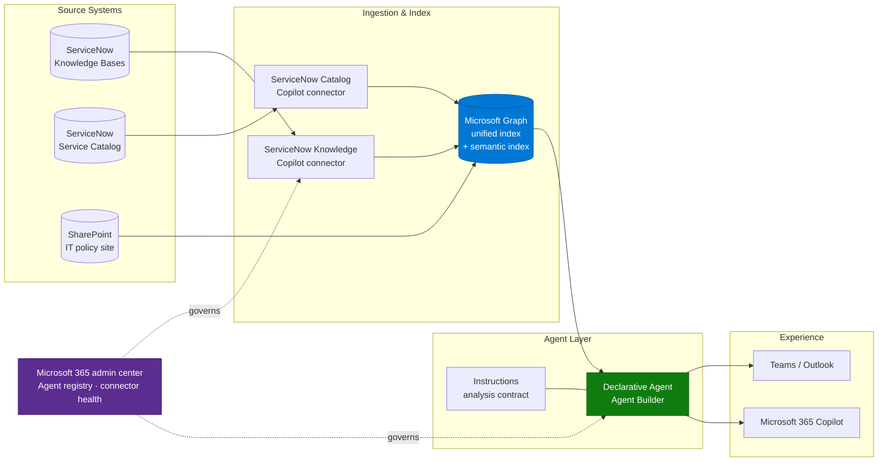

# Architecture — IT Service Desk Insights Agent

> **Platform**: Copilot Studio GitHub Copilot harness (Path B); Agent Builder reference (Path A)
> **Last Updated**: September 2026

---

## Path A - Read-Only Reference Architecture

The existing Agent Builder implementation uses the Copilot chat harness, not the Copilot
Studio standard harness. This diagram covers knowledge/catalog retrieval only; it contains
no incident, feedback, or diagnostic feed.

---

## Path A Technology Stack

| Layer | Component | Purpose |
|---|---|---|
| Source | ServiceNow (Xanadu / Yokohama / Zurich) | Knowledge articles, catalog items, user criteria |
| Ingestion | ServiceNow Knowledge Copilot connector | Crawls `kb_knowledge`, carries user criteria as ACLs |
| Ingestion | ServiceNow Catalog Copilot connector | Crawls catalog items and their descriptions |
| Index | Microsoft Graph unified index + semantic index | Full-text and semantic retrieval, permission filtering |
| Agent | Declarative agent (Agent Builder) | Instructions, knowledge scoping, starter prompts |
| Identity | Microsoft Entra ID | Identity mapping between Entra and ServiceNow users |
| Governance | Microsoft 365 admin center → Copilot → Agents / Connectors | Agent registry, availability, connector health |

---

## Harness Decision and Migration Trade-Offs

| Consideration | Path A: Agent Builder / Copilot chat harness | Path B: GitHub Copilot harness in Copilot Studio |
|---|---|---|
| Best fit | Lightweight knowledge and catalog Q&A | Bounded, multi-step investigation across tools |
| Procedure design | Agent instructions over configured knowledge | Agent-scoped skills plus constrained tools and workflows |
| Live tickets and actions | Not configured in this runbook's Path A | Available only through enabled, authorized tools |
| Adaptation | Primarily retrieval and response | Can inspect a result and choose the next permitted diagnostic step |
| Delivery effort | Connector onboarding and answer-quality work | Also requires capability contracts, backend controls, requester mappings, and operational support |
| Cost | Depends on Microsoft 365 licensing and consumption rules | Usage-based Copilot Credits, including building and previewing |
| Main risk | Retrieval coverage, source freshness, and permissions | Those risks plus consequential actions, retries, and identity propagation |

Use Path B for the expanded investigation scenario. This is a new agent configuration, not a
harness toggle on the existing declarative agent. Microsoft also documents that standard and
GitHub Copilot harness agents cannot be transferred between harnesses.

Do not justify migration solely by ticket creation, multilingual support, or MCP availability:
the standard harness supports tools, and declarative agents can have action plugins. The
benefit here is the combination of adaptive investigation and reusable, agent-scoped procedures.
No standalone GitHub CLI deployment, ERP connector, or GitHub engineering integration is needed.

## Path B - One Agent, Independently Enabled Capabilities

| Layer | Component | Responsibility |
|---|---|---|
| Experience | Published, authenticated Copilot Studio agent | Requester conversation and explicit action confirmations |
| Harness | GitHub Copilot harness | Bounded selection of knowledge, skills, and tools |
| Skills | Skills attached only to this agent | Operation-specific procedures; not security boundaries or organization-wide deployments |
| Tools | Narrow connector actions, workflow tools, or MCP tools | Typed inputs/outputs for one permitted operation |
| User context | Office 365 Users `GetMyProfile` | Current-user details and optional language default; scoped to this user's conversation |
| Execution policy | Backend/workflow authorization | Capability checks, requester/device scope, field allowlists, approvals, and deduplication |
| Systems | ServiceNow, Nexthink, optional Dynamics 365 Customer Service | Authoritative records, diagnostics, and business lifecycle |
| State and audit | Approved workflow store and source-system records | Operation IDs, evidence, approvals, partial outcomes, and recovery |

See the [capability matrix](0.Resources/Capability-matrix.md) for the complete mapping from
skill to tool, connector action, prerequisites, and dependencies. Tool names in that matrix
are implementation contracts, not a claim that deployable workflows are included.

**Investigation sequence:** intake, retrieve authorized evidence, evaluate, select another
permitted step, verify the result, then finish or hand off. Configure finite step/time budgets.
Do not repeat an accepted asynchronous action or a write whose outcome is unknown.

Store observed facts, source IDs, timestamps, and action results, not unrestricted raw logs.
Personal agent memory is optional and is not the authoritative incident record or audit log.

### Shared User Profile and Language

Expose Office 365 Users **Get my profile (V2)** (`MyProfile_V2`) as `GetMyProfile`.
The connection must belong to the end user, because "my" refers to the connection's user,
not automatically the person chatting when a workflow uses a maker-owned connection.
Select only `id,displayName,mail,userPrincipalName,preferredLanguage`.

Load these fields when needed and reuse them across skill activations in the current
conversation. Invalidate the cached result on user/connection changes and refresh on
request. Do not share it across users or treat it as cached permission evidence.

The returned profile supports intake and configured identity mapping; it is not proof of
ServiceNow requester status, a Dynamics contact relationship, or Nexthink device ownership.
Those remain backend decisions. No directory search or profile-update capability is exposed.

Response language follows explicit user preference, then current-message language, then
the profile's nonempty `preferredLanguage`. Ask if none resolves it. Keep the agreed backend
handoff language and exact technical identifiers. This profile tool does not provide timezone.
If profile retrieval fails, stop work needing missing details but allow source-authorized
knowledge reads that do not depend on them; never substitute another identity.

### Capability Execution Controls

Enabling an operation requires its skill, exposed tool, healthy connection, backend
authorization, and any required approval. Disabling a skill alone does not disable a tool.
Remove the corresponding connector action or disable the MCP tool and enforce the restriction
on every backend path, including workflows and alternate APIs.

Keep a shared connector enabled when other capabilities still need it. Do not expose generic
table updates, arbitrary HTTP calls, unrestricted remote-action IDs, or Dataverse upsert as
ways to bypass disabled operations. Validate the active profile at execution time; stale
conversations must not retain a revoked write permission.

Creation and every existing-record mutation are separate capabilities. A strict create-only
profile also disables notes, attachments, and requester closure. A profile may instead allow
requester closure while leaving general descriptive updates disabled.

### Routing Boundary - Backend-Owned

**No agent routing or assignment capability is included.** The agent cannot choose a queue,
assignee, assignment group, or case owner, either on creation or through an update. Creation
and update tool schemas must not accept these fields from the model; reject injected fields
rather than silently forwarding them.

ServiceNow and Dynamics backend teams own defaults, assignment rules, queues, and subsequent
routing. Their existing automation may assign a newly created record; that is not an agent
routing decision. A Dynamics escalation means creating a case with approved context, not
invoking `ApplyRoutingRule`, assigning `ownerid`, or adding it to an agent-selected queue.

### Closure Boundary - Requester Side Only

Expose only `CloseOwnIncident` and `CloseOwnCase` through dedicated requester-close workflows:

1. Require an explicit request/confirmation naming the record. A successful fix or "it works"
   is not permission to close anything.
2. Derive identity from authenticated context, never a requester ID supplied by the model.
   Re-read the record and verify the source-approved requester mapping immediately before
   executing the transition.
3. ServiceNow's requester mapping must be agreed with its admin (for example the incident
   caller relationship). In Dynamics, a support owner or a shared customer account is not
   proof of the individual requester; use a verified contact/requester relationship.
4. Enforce eligible states and the backend's requester-side lifecycle. The workflow may invoke
   a supported backend transition, including Dynamics `CloseIncident`, but cannot expose
   generic administrative resolution to the agent.
5. Return confirmed closed, already closed, pending backend processing, or blocked explicitly.
   If requester-side closure is unsupported for that record/state, do not force it using a
   privileged service account. Keep the capability OFF until an authorized path exists.

Requester-only restrictions apply even if a technician or administrator has read/write access.
Record both initiator and execution identity when a controlled backend uses service credentials.
Closing a ServiceNow incident does not close a linked Dynamics case, or vice versa; each needs
its own requester confirmation and authorization. Ownership/status changes invalidate a stale
approval and require reevaluation.

---

## Path A Data Flow

1. Connector crawls ServiceNow on a schedule — full crawl daily, incremental every 15 minutes
   by default. Identity and user-criteria mappings only refresh on a **full** crawl.
2. Each article is written to the Graph index with content, metadata, and an ACL derived from
   its `Can Read` / `Cannot Read` user criteria.
3. A user asks the agent a question in Microsoft 365 Copilot.
4. Retrieval runs against the index **as that user** — items whose ACL excludes them are never
   returned to the model.
5. The model applies the agent instructions (analysis contract, language rule, citation rule)
   and composes an answer.
6. Citations resolve through the `AccessUrl` property back into the ServiceNow portal.

---

## Integration Points

| Integration | Direction | Auth | Notes |
|---|---|---|---|
| ServiceNow → Graph | Inbound crawl | Federated Auth (recommended), OAuth 2.0, Entra OIDC, or Basic | Federated Auth avoids storing and rotating a client secret |
| Identity mapping | Inbound | Entra UPN / Mail → ServiceNow email | Custom mapping formula required if the org doesn't use email as the ServiceNow user key |
| Agent → Graph | Query time | End-user Entra identity | Security trimming is automatic |
| Agent → SharePoint (optional) | Query time | End-user Entra identity | Only if IT policy docs live outside ServiceNow |
| Path B → Office 365 Users | Current-user profile read | End-user connection | `GetMyProfile` / `MyProfile_V2`; minimal fields; no target-user input |
| Path B → ServiceNow | Live knowledge/incident operations | Prefer supported end-user connection; controlled service execution requires explicit caller authorization | Indexed KB ACLs do not authorize live actions |
| Path B → Nexthink | NQL and approved Remote Actions | Dedicated scoped API credentials | Backend must enforce user-to-device scope and action-ID allowlists |
| Path B → Dynamics Customer Service | Case operations through Dataverse | End-user connection or explicitly authorized backend identity | Fix environment/table; verify the individual requester for closure |

For Path B, choose and validate its knowledge connection separately. If existing Graph-indexed
content must be retained, an authorized retrieval adapter is an option; the Microsoft 365
Copilot Retrieval API supports connector content with delegated user permissions. Do not
assume existing connection configuration or permission evidence automatically transfers.

---

## Path A Connector Permission Model — Read This Before You Build

The connector's handling of ServiceNow user criteria is the single highest-risk part of this
architecture. Three specific behaviours matter:

1. **Simple vs Advanced flow.** The default **Simple** flow does not evaluate script-based user
   criteria. If a script-based criterion sits on a `Cannot Read` (deny) path, the connector
   fails safe and blocks that content **for everyone**. If your instance uses Advanced Scripts,
   you must select the **Advanced** flow and set up the Scripted REST API.

2. **Articles with no user criteria.** If neither the article nor its knowledge base has a
   `Can Read` criterion, visibility depends on the ServiceNow property
   `glide.knowman.block_access_with_no_user_criteria`. If the integration account cannot read
   `sys_properties`, the connector assumes `true` and blocks those articles.

3. **HR Service Delivery scope.** If any knowledge base lives in the `sn_hr_core` scope, the
   service account needs `sn_hr_core.content_reader` or `sn_hr_core.admin`. Without it the
   connector receives empty results rather than an error, may treat HR-restricted articles as
   unrestricted, and index compensation or disciplinary content as readable by everyone. This
   is the oversharing scenario that ends projects — verify it explicitly.

---

## Write-Back and Handoff Contracts

- Use separate operation schemas for creation, descriptive updates, internal notes,
  attachments, and requester closure. Never accept arbitrary field bags.
- Native ServiceNow `CreateRecord` documents a full-description limitation. Use a validated
  custom create operation if necessary; do not add a hidden update to a create-only profile.
- Use Dataverse `UpdateOnlyRecord` for permitted updates, not `UpdateRecord` (upsert).
- Check for an existing relevant ticket/case and use a correlation/idempotency key. Reconcile
  an unknown write outcome before retrying; duplicate records are not a fallback for disabled updates.
- A cross-system handoff is not atomic. If Dynamics creation succeeds but a separately enabled
  ServiceNow note fails, retain the Dynamics ID and report the partial outcome. Do not recreate it.
- Only transfer evidence authorized for the destination. Redact sensitive logs; do not reveal
  internal work notes to a requester who cannot read them.
- Test the actual end-user sign-in experience, including federated identity and connection
  consent. A maker-owned connection is not automatically an end-user connection.

---

## Non-Functional Considerations

| Concern | Guidance |
|---|---|
| Freshness | Path A follows crawl schedules; Path B reports live-tool observation timestamps and asynchronous execution state |
| Scope | No ERP, GitHub engineering support, agent routing, record deletion, catalog ordering, or unrestricted scripts |
| Latency and cost | Bound investigation steps and polling; measure handling time and consumption rather than assuming savings |
| Availability | Confirm tenant/cloud support and entitlements; GitHub-harness MCP integration and memory are documented as preview |
| Auditability | Correlate requester, execution identity, capability/profile version, approval, record/device ID, and actual outcome |
| Failure handling | Distinguish disabled, denied, unavailable, pending, failed, and unknown; never return success-shaped fallbacks |

## Product References

- [Harnesses in Copilot Studio](https://learn.microsoft.com/en-us/microsoft-copilot-studio/harnesses-overview)
- [GitHub Copilot harness agents and migration constraints](https://learn.microsoft.com/en-us/microsoft-copilot-studio/agents-experience/overview)
- [Skills](https://learn.microsoft.com/en-us/microsoft-copilot-studio/agents-experience/skills-overview) and [tool management](https://learn.microsoft.com/en-us/microsoft-copilot-studio/agents-experience/tools-manage)
- [Usage-based billing](https://learn.microsoft.com/en-us/microsoft-copilot-studio/agents-experience/billing-credit-overview)
- [Microsoft 365 Copilot Retrieval API](https://learn.microsoft.com/en-us/microsoft-365/copilot/extensibility/api/ai-services/retrieval/copilotroot-retrieval)
- [Declarative-agent action plugins](https://learn.microsoft.com/en-us/microsoft-365/copilot/extensibility/overview-plugins)

---

## Next

→ [3.Runbook.md](3.Runbook.md) — step-by-step implementation
